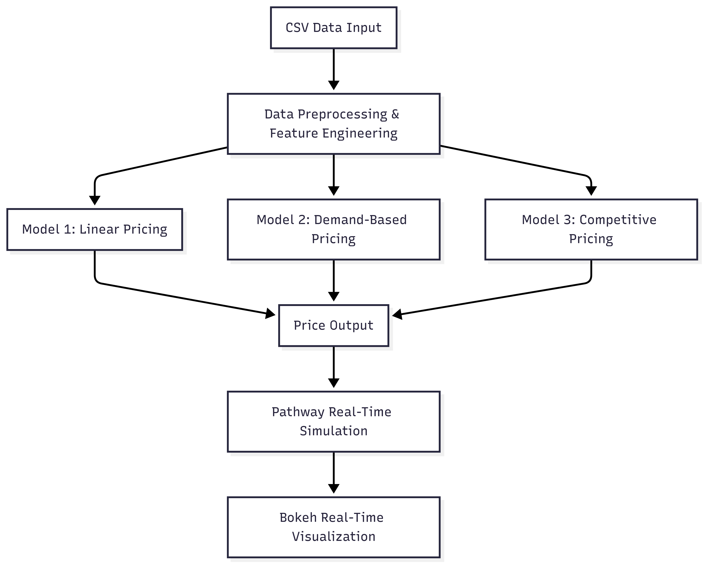
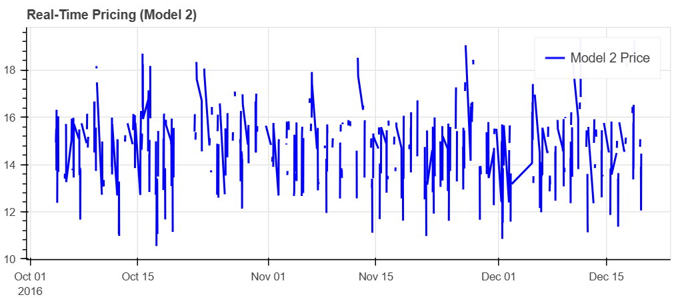
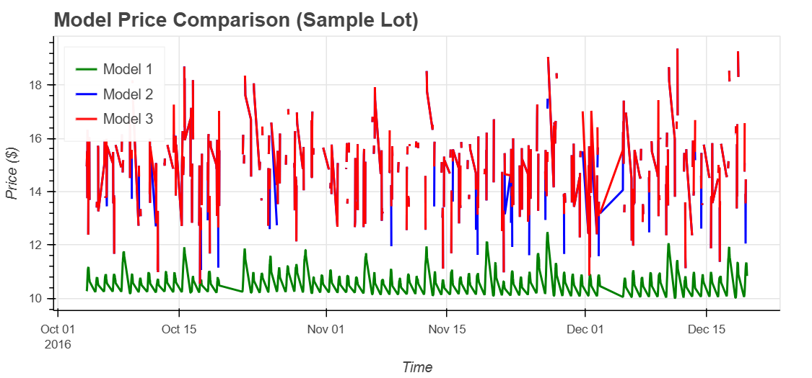
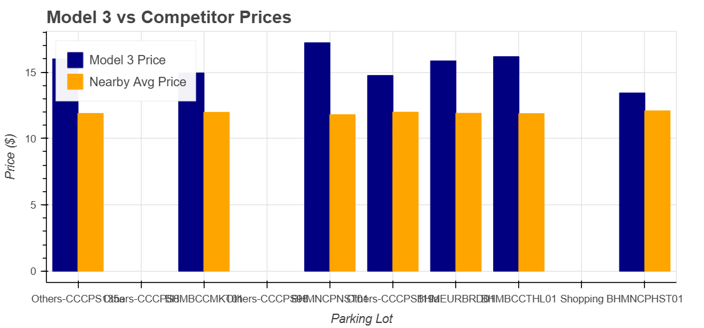

## View the full notebook with Bokeh graphs in Google Colab:  
> [](https://colab.research.google.com/drive/1-i-o8WzE-XAomBxVczTcrFy-8LsQ18Hh?usp=sharing)

## Project Overview:

 The project Dynamic Pricing for Urban Parking Lots seeks to address the issue of inefficient pricing in urban parking lots with the help of creating a real-time dynamic pricing system. Static pricing frequently results in crowded or underutilized parking lots, which reduces revenue and irritates drivers.

In order to address this, we developed three increasingly intelligent pricing models that modify prices according to:

- **Occupancy rate**

- **Queue length**

- **Traffic congestion**

- **Special events**

- **Vehicle Type**

- **Nearby competitor pricing**

Using Pathway, the system simulates live data streaming and updates prices in real time. The final system also visualizes pricing behavior using Bokeh, offering insights into model performance and competitiveness.

---


## Tech stack used :

- **Python** – Programming language for data models and logic

- **Pandas** – Data processing and manipulation

- **NumPy** – Calculations using numbers

- **Pathway** – Processing and streaming data in real time

- **Bokeh** – For data visualization

- **Google Colab** – Cloud-based Jupyter notebook environment

- **GitHub** – Platform for project submission

---

## Architecture Diagram:

The data pipeline and logic from raw input to the final price output are depicted in this diagram.



---

####  Real-Time Pricing Visualizations (Bokeh Plots)
These visualisations show how prices vary depending on occupancy, queue levels, and competition, using various pricing models.

---
###  Model 2: Real-Time Pricing Over Time:
This plot depicts how pricing changes over time using demand-based features such as queue and occupancy.


---
### Comparison of Pricing Models:
This line plot compares pricing behavior for Models 1, 2, and 3 over the same time period.


---
###  Model 3 vs Competitor Pricing

This bar chart shows how Model 3 prices compare with average prices at nearby competitor parking lots


## Project architecture and workflow:

The purpose of this project is to model an urban parking lot's **real-time dynamic pricing system**. Data preprocessing, pricing logic, Pathway real-time simulation, and Bokeh visualization are all integrated into the architecture.

###  Workflow Steps:

1. **Data Ingestion**
- A dataset with records from 14 parking spaces spanning 73 days is loaded.

- Date and time fields are combined to create time features.

---

2. **Features Engineering**
- Important features were derived, including:

- `occupancy_rate` = Occupancy / Capacity

-   Normalized traffic level and queue length

- Special event flag (`IsSpecialDay`)

- Weighting by vehicle type (bike = 0.5, car = 1.0, etc.)

----

3. **Baseline Linear Pricing(Model 1)**
- Price increases linearly with occupancy.

- Formula used:  

    ```

    Price = Base_Price + α × (Occupancy / Capacity)

   ```
---

4. **Demand-Based Pricing (Model 2)**

 - Key features (occupancy, traffic, events, vehicle type, and queue) are used to create a weighted demand function

- Normalized demand is used to smoothly adjust the price.

- The formula is as follows: 
 

   ```
    Price = Base_Price × (1 + λ × Normalized_Demand) 


   ```

---

5. **Competitive Pricing (Model 3)**

-By utilizing competitor pricing and location to compare with neighboring parking lots, the Model     
 2 is improved.

- Price is dynamically adjusted:
- Reduce if overworked and cheaper competitors are available.
- Increase if the prices of competitors are higher.

---

6. **Real-Time Simulation with Pathway**

- Information is streamed as though it were coming in real time.
- Maintaining timestamp order and consistently applying pricing logic are two uses for Pathway.
- Provide current prices for each lot.

---

7. **Bokeh Visualization**

- Time-series plots display each model's price change over time.
- Pricing decisions in comparison to competitors are highlighted by comparative bar charts.
- Bokeh is utilized in the notebook because of its interactive and real-time plotting features.

---

 ###  Summary of Key Modules:

- `Feature Engineering & Preprocessing`- Taking useful characteristic out of unprocessed data.

- `Model Definitions` - Every pricing model was developed gradually and logically.

- `Real-Time Processing` - Pathway's streaming table and UDF logic were used to simulate.

- `Visualization` - Using easily comprehensible plots, the model behavior was explained.

---

## Additional Notes and Assumptions:

- Demand weights (α, β, γ, δ, ε) were manually selected according to trial and feature importance.

- In order to simulate in real time, timestamped data was fed sequentially into Pathway.

- For simplicity, "Special Days" were handled as binary (1 if special, else 0).

- With weights of 1.0 and 0.5, the vehicle types were narrowed down to two: `car` and `bike`.

- To maintain reasonable bounds, price caps were set between $5 and $20.

- Competitive pricing rerouted when overloaded and used the average prices of neighboring lots
  (same timestamps).        
---


